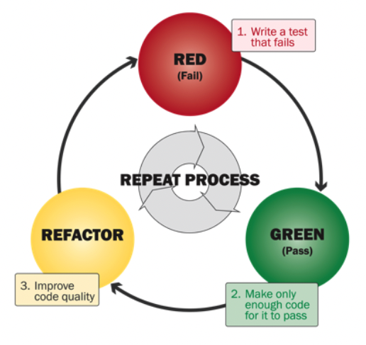
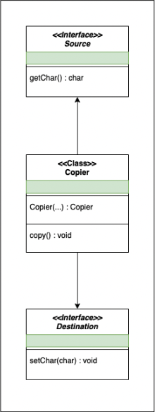

# Test-Driven Development

[][1]
[][2]
[][3]

The goal of these exercises is to practise **test-driving your code** following the `RED-GREEN-REFACTOR` cycle.

For the exercises below, we've provided the starter project above.

## :bee: FizzBuzz

Create a class `FizzBuzz` with a `get` method that takes a number and returns a string, but such that:
- for multiples of 3, it returns `“Fizz”` instead of the number
- for multiples of 5, it returns `“Buzz”` instead of the number
- for multiples of 15, it returns `“FizzBuzz”` instead of the number
- the string representation of the number otherwise

| Input | Output     |
|-------|------------|
| 1     | "1"        |
| 2     | "2"        |
| 3     | "Fizz"     |
| 4     | "4"        |
| 5     | "Buzz"     |
| 6     | "Fizz"     |
| 7     | "7"        |
| 8     | "8"        |
| 9     | "Fizz"     |
| 10    | "Buzz"     |
| 11    | "11"       |
| 12    | "Fizz"     |
| 13    | "13"       |
| 14    | "14"       |
| 15    | "FizzBuzz" |
| ...   | ...        |

## :spiral_calendar: Leap Year

Create a class `Year` with a `isLeap` method that checks whether its input integer is a Leap Year or not:
- years divisible by `400` are leap years
- years divisible by `100` but not by `400` are not leap years
- years divisible by `4` but not by `100` are leap years
- years not divisible by `4` are not leap years

| Input | Output |
|-------|--------|
| 1700  | false  |
| 1800  | false  |
| 1900  | false  |
| 2000  | true   |
| 2001  | false  |
| 2002  | false  |
| 2003  | false  |
| 2004  | true   |
| 2005  | false  |
| 2006  | false  |
| 2007  | false  |
| 2008  | true   |
| 2009  | false  |
| 2010  | false  |
| 2011  | false  |
| ...   | ...    |

## :keyboard: Character Copier

A `CharacterCopier` is a simple class that reads characters from a `Source` and copies them to a `Destination` one character at a time.
When the `copy` method is called on the copier then it should read characters from the source and copy them to the destination until the source returns a new line (`\n`).

Implement the character copier using test doubles for the source and the destination.
- Iteration 1: try using spies (write your test doubles manually)
- Iteration 2: try using mocks (using Mockito).

Start from the definitions on the diagram.

[1]: https://docs.oracle.com/javase/11/docs/api/index.html
[2]: https://junit.org/junit5/
[3]: https://maven.apache.org/