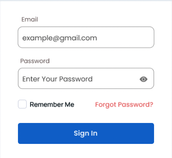

# Web Applications

[][1]

The goal of these programming exercises is to practise:
- working with a web server
- working with a web client
- creating simple HTML pages

## :globe_with_meridians: HTTP

**<ins>Exercise 1</ins>**

Analyse the followint HTTP request:

```
    GET /martignon/index.html HTTP/1.1
    Host: cs.unibg.it
    User Agent: Mozilla/5.0 (Macintosh; U; PPC Mac OS X; en) AppleWebKit/124
    (KHTML, like Gecko) Safari/125
    Accept: ext/xml, application/xml, application/xhtml+xml, text/html;q=0.9,
    text/plain;q=0.8, image/png,*,*;q=0.5
    Accept-Language: it
    Keep-Alive: 300
    Connection: keep-alive
```

1. What is the requested URL?
2. Which version of HTTP is used?
3. Does the browser ask for a persistent or a non-persistent connection?
4. What is, in your opinion, the utility in indicating the type (and version) of browser used by
the client in the HTTP Request?

**<ins>Exercise 2</ins>**

An HTTP client sends the following message:

```
    GET http://cs.unibg.it /index.html HTTP/1.1
    User-agent: Mozilla/4.0
    Accept: text/html, image/gif, image/jpeg
    If-modified-since: 27 Feb 2017 08:10:00
```

Write down two feasible responses of the HTTP server (only the status line)

## :spider_web: HTML

An HTML Form is a section of the document that collects input from the user. The input from the user is generally sent to a server (Web servers, Mail clients, etc). We use the HTML `<form>` element to create forms in HTML.

Read [this documentation][2], and create a HTML form that looks like the following:




[1]: https://developer.mozilla.org/en-US/docs/Web/HTML
[2]: https://developer.mozilla.org/en-US/docs/Learn/Forms/HTML5_input_types